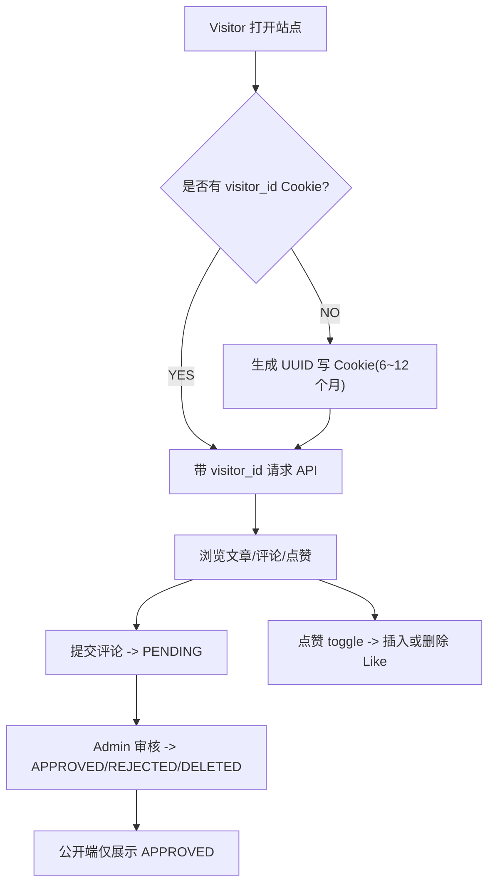
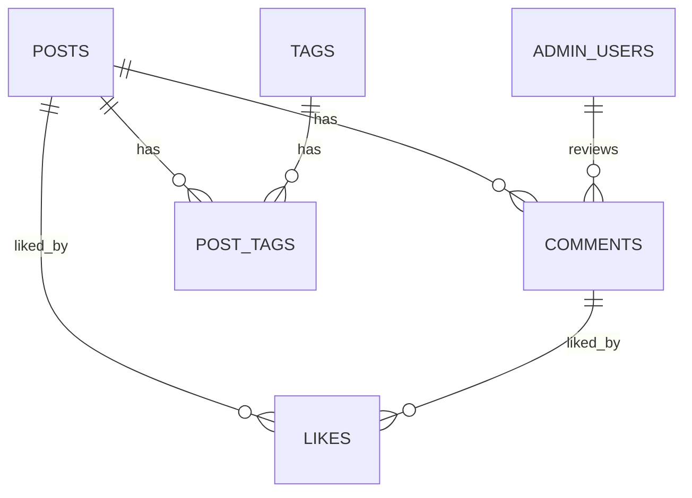
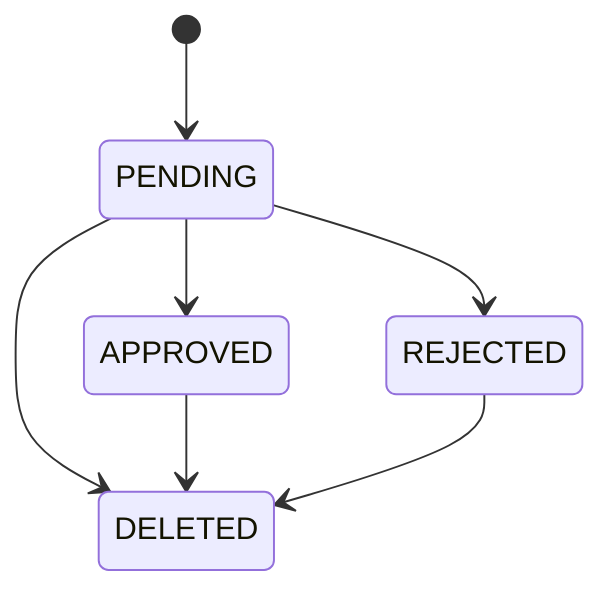
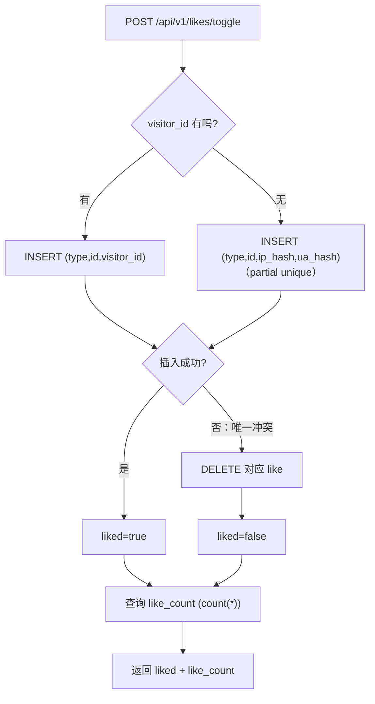

# 最小可行性设计文档（MVP）
**项目：单作者博客 + 匿名评论/点赞（预留 OAuth 扩展点）**  
**基准：4×1 周 Sprint 敏捷计划（每周可演示增量）**  
**技术选型已确定：Java 21 + Maven + Spring Boot + MyBatis/MBG + Flyway + PostgreSQL + Next.js App Router + 全容器化 + 同域部署（/api 反代）**

---

## 0. 背景、目标与范围

### 0.1 背景
你是站点唯一内容作者（Admin），访客无需登录即可阅读文章并进行匿名互动（评论/点赞）。为了可控与抗垃圾内容，评论默认待审；点赞需支持 toggle（点一次赞，再点取消），并具备最小防刷能力。

### 0.2 MVP 目标（必须实现）
1. **公开阅读闭环**：文章列表/详情（仅已发布），支持标签（列表 + 过滤）。
2. **管理端闭环**：只有 Admin 可登录（JWT）并进行文章创建/编辑/发布/下线。
3. **匿名评论闭环**：访客提交评论 → 默认待审 → Admin 审核 → 前台只展示已通过。
4. **匿名点赞闭环**：文章/评论点赞 toggle，利用数据库唯一约束保证一致性。
5. **可部署可演示**：Docker Compose 一键启动；同域反代 `/api` 到后端；基础安全/XSS 加固。

### 0.3 非目标（MVP 不做）
- 多作者、多角色权限体系
- 访客账号体系、OAuth 真正登录（仅预留字段/扩展点，不实现流程）
- 复杂风控（黑名单、机器学习反垃圾、短信验证等）
- 高性能计数缓存（Redis/异步计数）；MVP 允许实时 count

---

## 1. 敏捷交付节奏对齐（4×1 周 Sprint）

> 原则：每个 Sprint 都能“可演示、可上线”，并且 DB 迁移脚本随 Sprint 递增。

|Sprint|周期目标（Outcome）|可 Demo 交付物|对应 Flyway|
|---|---|---|---|
|Sprint 1|公开阅读闭环：DB→API→Next 页面跑通|`docker compose up`；文章列表/详情；标签列表/过滤；同域前端访问 `/api/v1/...`|V1：posts/tags/post_tags|
|Sprint 2|管理端闭环：只有你能发文（JWT）|admin_users + 登录；Admin 文章 CRUD；publish/unpublish|V2：admin_users（+ seed）|
|Sprint 3|匿名评论闭环：提交待审 + 审核 + 前台展示|visitor_id（cookie+header）；评论 PENDING；审核 approve/reject/delete；前台仅 APPROVED|V3：comments|
|Sprint 4|匿名点赞 + 上线加固：toggle + 同域部署|likes 表 + 部分唯一索引；点赞 toggle 稳定；Nginx/Caddy 反代 `/api`；XSS/安全头|V4：likes|

---

## 2. 用户故事、角色与用例

### 2.1 角色（Personas）
- **Admin（站长/作者）**：登录后台，管理文章，审核评论。
- **Visitor（访客）**：匿名访问、匿名评论（待审）、匿名点赞（toggle）。

### 2.2 用户故事（按 MVP 优先级）
**Visitor**
1. 作为访客，我可以浏览文章列表/详情，方便阅读内容（仅已发布）。
2. 作为访客，我可以查看标签列表并按标签过滤文章，便于发现内容。
3. 作为访客，我可以提交匿名评论，系统提示“待审核”，避免垃圾内容直接展示。
4. 作为访客，我可以对文章/评论点赞（再次点击取消），表达反馈。
5. 作为访客，我的点赞/评论在同一浏览器下应具备基本防刷能力（visitor_id 判重 + 简易限流）。

**Admin**
6. 作为站长，我可以登录后台（JWT），确保只有我能写文章。
7. 作为站长，我可以创建/编辑文章，保存草稿，发布/下线。
8. 作为站长，我可以审核评论（通过/拒绝/删除），并查看评论指纹（visitor/ip_hash/ua_hash）。

### 2.3 核心用例（Use Cases）

#### UC-01 浏览文章
- 触发：访客进入首页或文章详情
- 主流程：
  1. 拉取文章列表（仅 `PUBLISHED` 且 `deleted_at IS NULL`）
  2. 点击某篇文章进入详情
  3. 展示文章内容 + 已通过评论 + 点赞状态与计数
- 关键规则：公开端永不返回草稿/待审评论/被删除内容

#### UC-02 提交匿名评论（待审）
- 触发：访客在文章详情提交评论
- 主流程：
  1. 前端确保存在 `visitor_id`（cookie）并在请求中携带
  2. 后端校验内容并记录指纹（visitor_id/ip_hash/ua_hash）
  3. 保存评论 `status=PENDING`
  4. 返回“已提交，等待审核”
- 关键规则：公开端仅展示 `APPROVED`

#### UC-03 点赞 toggle（文章/评论通用）
- 触发：访客点击点赞按钮
- 主流程：
  1. 依据 `(target_type, target_id, visitor_id)` 唯一约束判重（无 visitor_id 时 fallback 到 `(ip_hash, ua_hash)` 部分唯一索引）
  2. 未点赞 → 插入 like；已点赞 → 删除 like（取消）
  3. 返回最新 `liked` 状态与 `like_count`
- 关键规则：同一访客对同一目标最多 1 条有效点赞（由 DB 约束保证）

#### UC-04 评论审核
- 触发：Admin 在后台查看待审评论
- 主流程：
  1. 拉取 `status=PENDING` 评论列表
  2. 逐条 approve/reject/delete
  3. 更新状态，并记录 reviewed_at / reviewed_by
- 关键规则：审核动作必须鉴权；公开端不返回 `REJECTED/DELETED`

### 2.4 关键流程图（Mermaid）


---

## 3. 总体架构与工程约定

### 3.1 技术栈（已定稿）
- **后端**：Spring Boot（Java 21、Maven）
  - 数据访问：MyBatis + MyBatis Generator（MBG 只生成基础 CRUD）
  - 数据迁移：Flyway（所有约束/索引在 SQL 迁移中定义）
  - 鉴权：Spring Security + JWT（仅保护 `/api/v1/admin/**`）
  - 文档：OpenAPI/Swagger（用于 Sprint2 快速验收管理端）
- **数据库**：PostgreSQL（主存储）
- **前端**：Next.js（App Router）
  - 公共站点 + 最小 `/admin`（或仅 Swagger 也可验收 Sprint2）
- **部署**：Docker Compose（开发与生产）
  - 反代：Nginx 或 Caddy
  - **同域部署**：`/api/` → Spring Boot，`/` → Next.js
- **缓存/限流**：MVP 不依赖 Redis（后续可加）

### 3.2 单仓库目录建议
```
/server   Spring Boot (Java 21, Maven)
/web      Next.js (App Router)
/deploy   compose 生产版、nginx/caddy 配置、脚本
```

### 3.3 MyBatis/MBG 约定（强约束）
- **MBG 只生成基础 CRUD**：生成目录不手改
- 复杂查询/Join/批量查询：全部放到 `*MapperExt.java` + `*MapperExt.xml`
- Flyway 负责：
  - 表结构、索引、唯一约束、部分唯一索引（partial unique index）
  - 不把这些交给 MBG 或注解

### 3.4 同域部署与请求约定（Next App Router 关键点）
- 浏览器端请求：统一使用相对路径 `/api/v1/...`（同域，无 CORS）
- **Server Component / SSR 拉数据**：
  - 相对路径可能不可用或受环境影响
  - 建议使用 `INTERNAL_API_BASE=http://server:8080`（容器网络内）
- 动态数据（评论/点赞计数）fetch：
  - 使用 `cache: 'no-store'` 或 `revalidate: 0`，避免 App Router 缓存导致数据不刷新

---

## 4. 数据库设计（PostgreSQL + Flyway）

### 4.1 迁移脚本规划
- `V1__init_posts_tags.sql`：posts / tags / post_tags（含索引与最小 seed）
- `V2__admin_users.sql`：admin_users（含初始 admin seed）
- `V3__comments.sql`：comments（含审核状态与索引）
- `V4__likes.sql`：likes（含唯一约束与部分唯一索引）

### 4.2 ER 关系图（Mermaid）


### 4.3 表结构（MVP 关键字段）

> 时间字段统一使用 `timestamptz`（建议存 UTC）；`created_at/updated_at` 默认 `now()`。

#### 4.3.1 `posts`（文章）
|字段|类型|约束/说明|
|---|---|---|
|id|bigserial|PK|
|title|varchar(200)|NOT NULL|
|slug|varchar(200)|UNIQUE，可选但推荐（SEO）|
|summary|text|可选|
|cover_url|text|可选|
|content|text|NOT NULL|
|content_type|varchar(20)|`PLAIN/MARKDOWN`|
|status|varchar(20)|`DRAFT/PUBLISHED`|
|published_at|timestamptz|发布时写入|
|deleted_at|timestamptz|软删；公开端过滤|
|created_at|timestamptz|NOT NULL|
|updated_at|timestamptz|NOT NULL|

索引建议：
- `(status, published_at desc)`（配合公开列表）
- `slug` unique index
- `deleted_at` 可不单独建索引（依查询情况决定）

#### 4.3.2 `tags` / `post_tags`
`tags`：

|字段|类型|约束/说明|
|---|---|---|
|id|bigserial|PK|
|slug|varchar(64)|UNIQUE, NOT NULL|
|name|varchar(64)|NOT NULL|
|created_at|timestamptz|NOT NULL|

`post_tags`：

|字段|类型|约束/说明|
|---|---|---|
|post_id|bigint|FK -> posts.id|
|tag_id|bigint|FK -> tags.id|
|pk|(post_id, tag_id)|复合主键|

索引建议：
- `post_tags(tag_id, post_id)`（用于 tag 过滤）

#### 4.3.3 `admin_users`（仅你）
|字段|类型|约束/说明|
|---|---|---|
|id|bigserial|PK|
|username|varchar(64)|UNIQUE, NOT NULL|
|password_hash|varchar(100)|NOT NULL（bcrypt）|
|is_active|boolean|NOT NULL DEFAULT true|
|last_login_at|timestamptz|可选|
|created_at|timestamptz|NOT NULL|
|updated_at|timestamptz|NOT NULL|

#### 4.3.4 `comments`（匿名评论 + 审核）
|字段|类型|约束/说明|
|---|---|---|
|id|bigserial|PK|
|post_id|bigint|FK -> posts.id|
|content|text|NOT NULL|
|status|varchar(20)|`PENDING/APPROVED/REJECTED/DELETED`|
|nickname|varchar(64)|可空|
|email|varchar(200)|可空（MVP 不用于登录，仅留存）|
|visitor_id|uuid|可空（核心判重标识）|
|ip_hash|char(64)|可空（sha256 hex）|
|ua_hash|char(64)|可空（sha256 hex）|
|author_type|varchar(10)|`ANON/OAUTH`，默认 ANON（预留）|
|author_id|bigint|可空（预留 users.id）|
|reviewed_at|timestamptz|可选|
|reviewed_by|bigint|可选（admin_users.id）|
|created_at|timestamptz|NOT NULL|

索引建议：
- `(post_id, status, created_at desc)`（文章页评论展示）
- `(status, created_at desc)`（后台待审列表）

> 删除策略：评论删除使用 `status=DELETED`（可审计、可回溯），不做硬删。

#### 4.3.5 `likes`（点赞：POST/COMMENT + toggle）
|字段|类型|约束/说明|
|---|---|---|
|id|bigserial|PK|
|target_type|varchar(10)|`POST/COMMENT`|
|target_id|bigint|文章或评论 id|
|visitor_id|uuid|可空|
|ip_hash|char(64)|可空|
|ua_hash|char(64)|可空|
|user_id|bigint|可空（预留 OAuth 用户）|
|created_at|timestamptz|NOT NULL|

唯一约束（关键）：
1. `UNIQUE(target_type, target_id, visitor_id)`（当 visitor_id 不为空）
2. 部分唯一索引（visitor_id 为空时 fallback）  
   `UNIQUE(target_type, target_id, ip_hash, ua_hash) WHERE visitor_id IS NULL`

索引建议：
- `(target_type, target_id)`（便于 count 聚合）

---

## 5. 详细设计（核心模块）

### 5.1 visitor_id（匿名身份）策略（Sprint3）
**目标**：在不登录的前提下，为“判重/防刷/点赞 toggle”提供稳定的浏览器级标识。

- **前端（Next Middleware 推荐）**
  - 每次请求检查 cookie 是否存在 visitor_id
  - 不存在则生成 UUID 并写入 cookie（有效期建议 6–12 个月）
- **cookie 建议**
  - 名称可用：`__Host-visitor_id`
  - `Secure`：生产必须开启（HTTPS）
  - `SameSite=Lax`
  - **不设置 HttpOnly**（因为前端需要读 cookie 并写入 `X-Visitor-Id` header；若你更想 HttpOnly，也可改为后端直接读 cookie，不依赖 header）
- **请求携带**
  - 推荐 header：`X-Visitor-Id: <uuid>`
  - 后端处理优先级：header → cookie → fallback（ip_hash+ua_hash）

**指纹存证（后端）**
- IP：从反代读取 `X-Forwarded-For`（只信任你的 Nginx/Caddy 注入），取最左侧客户端 IP
- UA：`User-Agent`
- 存储：仅存 `sha256(ip)`、`sha256(ua)`，不存原文（仍需在隐私声明中说明）

### 5.2 评论提交与审核（Sprint3）
**提交评论（Public）**
- 校验：
  - `content` 非空，长度 1–2000
  - `nickname` 0–64（可选）
  - `email` 格式校验（可选）
- 入库：
  - `status=PENDING`
  - 记录 visitor_id / ip_hash / ua_hash
- 基础频控（不依赖 Redis，DB 窗口）：
  - 规则建议：同一 visitor_id（或 fallback 指纹）在 60 秒内超过 N 条（如 3）→ 返回 `429 RATE_LIMITED`
- 返回：
  - `{status: "PENDING", message: "已提交，等待审核"}`

**审核评论（Admin）**
- approve：`PENDING -> APPROVED`
- reject：`PENDING -> REJECTED`
- delete：`PENDING/APPROVED/REJECTED -> DELETED`
- 记录：
  - `reviewed_at=now()`
  - `reviewed_by=<admin_users.id>`

状态机：


> MVP 不做站长通知（邮件/Telegram/Webhook）；在后台待审列表查看即可。通知作为后续增强项。

### 5.3 点赞 toggle（强一致实现，Sprint4）
**原则**：不要“先查再插/删”（TOCTOU 并发风险）；让 DB 唯一约束做裁判。

实现流程：
1. 尝试 `INSERT likes(...)`
2. 若命中唯一冲突（PostgreSQL `23505`，Spring 常见为 `DuplicateKeyException`）
   - 说明已经点过赞 → 执行 `DELETE` 对应记录（取消）
3. 查询最新 `like_count = count(*)`
4. 返回 `{liked: true/false, like_count: number}`

流程图：


计数策略（MVP 决策）：
- **MVP：实时 count**（简单可靠）
- 后续再考虑 Redis/异步计数优化

### 5.4 文章发布与状态（Sprint2）
- 草稿保存：`status=DRAFT`
- 发布：`POST /admin/posts/{id}/publish`
  - `status=PUBLISHED`
  - `published_at=now()`
- 下线：`POST /admin/posts/{id}/unpublish`
  - `status=DRAFT`
  - `published_at` 可保留（用于历史）或置空（更干净），**MVP 建议保留**
- 删除：软删 `deleted_at=now()`（公开端过滤；后台可见/可恢复作为后续增强）

### 5.5 内容渲染与 XSS（Sprint4 加固项）
- 文章内容：Markdown 渲染时必须启用 sanitize（白名单策略）
- 评论内容：**永远不可信**
  - 显示时做 HTML 转义（或严格 sanitize），禁止原样 HTML 注入
- 安全头（反代层或 Next 层设置）：
  - 至少：`Content-Security-Policy`（最小可行）、`X-Content-Type-Options: nosniff`、`Referrer-Policy`、`X-Frame-Options`/`frame-ancestors`

### 5.6 统一错误响应与可观测性（建议 Sprint1 就落地）
- 每次请求生成 `trace_id`（或复用网关注入）
- 统一错误结构（便于前端排错与日志检索）

---

## 6. API 设计（REST）

### 6.1 返回结构约定（MVP 推荐：统一包一层）
成功：
```json
{
  "code": "OK",
  "message": "",
  "data": {}
}
```

失败：
```json
{
  "code": "VALIDATION_ERROR",
  "message": "content is required",
  "data": null,
  "trace_id": "..."
}
```

分页：
```json
{
  "code": "OK",
  "message": "",
  "data": {
    "items": [],
    "page": { "limit": 10, "offset": 0, "total": 123 }
  }
}
```

### 6.2 Public API（无需登录）

|功能|方法|路径|说明|
|---|--:|---|---|
|文章列表|GET|`/api/v1/posts?limit=&offset=&tag=`|仅 PUBLISHED 且未删除；可选 tag slug 过滤|
|文章详情|GET|`/api/v1/posts/{id}`|返回文章内容、标签、计数、viewer_has_liked|
|标签列表|GET|`/api/v1/tags`|含 post_count（可选，但推荐）|
|评论列表|GET|`/api/v1/posts/{postId}/comments`|仅 APPROVED|
|提交评论|POST|`/api/v1/posts/{postId}/comments`|写入 PENDING|
|点赞 toggle|POST|`/api/v1/likes/toggle`|POST/COMMENT 通用|

请求头（匿名交互建议统一）：
- `X-Visitor-Id: <uuid>`（推荐）
- 后端读取 IP/UA（反代注入）

**提交评论 body**
```json
{
  "content": "text",
  "nickname": "optional",
  "email": "optional"
}
```

**点赞 toggle body**
```json
{
  "target_type": "POST",
  "target_id": 1
}
```

**文章详情响应 data 示例（建议字段）**
```json
{
  "id": 1,
  "title": "...",
  "slug": "hello-world",
  "content_type": "MARKDOWN",
  "content": "...",
  "status": "PUBLISHED",
  "published_at": "2026-01-01T00:00:00Z",
  "tags": [{"slug": "java", "name": "Java"}],
  "counts": {
    "comment_count": 12,
    "like_count": 34
  },
  "viewer_has_liked": true
}
```

**评论列表响应 data 示例（建议字段）**
```json
{
  "items": [
    {
      "id": 10,
      "content": "不错！",
      "nickname": "匿名",
      "created_at": "2026-01-01T00:00:00Z",
      "like_count": 3,
      "viewer_has_liked": false
    }
  ]
}
```

> viewer_has_liked 的实现要求避免 N+1：对评论 id 列表做一次批量查询。

### 6.3 Admin API（JWT）

|功能|方法|路径|说明|
|---|--:|---|---|
|登录|POST|`/api/v1/admin/auth/login`|返回 JWT（或设置 admin cookie）|
|后台文章列表|GET|`/api/v1/admin/posts?status=`|含 DRAFT/PUBLISHED；可包含已软删（可选）|
|创建文章|POST|`/api/v1/admin/posts`|创建草稿|
|更新文章|PUT|`/api/v1/admin/posts/{id}`|编辑草稿/已发布（按你策略）|
|发布|POST|`/api/v1/admin/posts/{id}/publish`|显式动作|
|下线|POST|`/api/v1/admin/posts/{id}/unpublish`|显式动作|
|删除文章|DELETE|`/api/v1/admin/posts/{id}`|软删（写 deleted_at）|
|待审评论列表|GET|`/api/v1/admin/comments?status=PENDING&limit=&offset=`|后台审核列表|
|通过评论|POST|`/api/v1/admin/comments/{id}/approve`||
|拒绝评论|POST|`/api/v1/admin/comments/{id}/reject`||
|删除评论|DELETE|`/api/v1/admin/comments/{id}`|置 DELETED|

**登录请求**
```json
{ "username": "admin", "password": "******" }
```

**登录响应 data（示例）**
```json
{ "token": "jwt..." }
```

> JWT 存储建议：管理端使用 HttpOnly Secure cookie（更安全）；如果先用 Swagger 验收，也可先走 Authorization: Bearer。

### 6.4 状态码与错误码（最小集合）
- `200/201`：成功
- `400 VALIDATION_ERROR`：参数校验失败
- `401 UNAUTHORIZED`：未登录/Token 失效
- `403 FORBIDDEN`：无权限（通常不会发生，只有你一个 admin）
- `404 NOT_FOUND`：资源不存在
- `429 RATE_LIMITED`：频控触发  
> 点赞 toggle 内部的 `409/23505` 冲突应被业务吞掉并转为“取消点赞”分支，不对外暴露为错误。

---

## 7. 部署设计（全容器化 + 同域）

### 7.1 Docker Compose（逻辑结构）
- `db`：PostgreSQL（仅内部网络）
- `server`：Spring Boot（8080）
- `web`：Next.js（3000）
- `gateway`：Nginx/Caddy（80/443，对外唯一入口）

### 7.2 同域反代路由（关键）
- `/api/` → `server:8080`
- `/` → `web:3000`

> 约束：Next 不实现同名 `/api` Route Handlers，避免冲突与绕路。

Nginx 示意（片段）：
```nginx
location /api/ {
  proxy_pass http://server:8080/;
  proxy_set_header Host $host;
  proxy_set_header X-Forwarded-For $proxy_add_x_forwarded_for;
  proxy_set_header X-Forwarded-Proto $scheme;
}

location / {
  proxy_pass http://web:3000/;
  proxy_set_header Host $host;
}
```

### 7.3 环境变量建议
- `SPRING_DATASOURCE_URL=jdbc:postgresql://db:5432/xxx`
- `SPRING_DATASOURCE_USERNAME=...`
- `SPRING_DATASOURCE_PASSWORD=...`
- `JWT_SECRET=...`（生产必须强随机）
- `INTERNAL_API_BASE=http://server:8080`（Next SSR 用）

---

## 8. 验收标准（Definition of Done）与测试清单

### 8.1 Sprint 1 DoD（公开阅读）
- `docker compose up` 后：
  - 首页能看到文章列表（仅 PUBLISHED）
  - 点击进入文章详情能渲染内容
  - 标签列表可见；按 tag 过滤可用（若本 Sprint 覆盖该项）
- Flyway V1 正常执行；MBG 生成可用；Public API 可分页

### 8.2 Sprint 2 DoD（管理端）
- 你能登录拿到 JWT
- 能创建草稿 → 发布 → Public 首页立刻看到
- 能下线文章 → Public 不再展示

### 8.3 Sprint 3 DoD（评论 + 审核）
- 访客提交评论 → 前台不显示（PENDING）
- Admin approve 后 → 前台立刻显示（APPROVED）
- reject/delete 后 → 前台不显示
- 基础限流触发时返回 429

### 8.4 Sprint 4 DoD（点赞 + 上线加固）
- 文章/评论点赞 toggle 稳定：点一次赞、再点取消；刷新后状态不乱
- DB 唯一约束生效：并发下也不会出现重复点赞
- 同域部署可访问（/api 反代正确）
- 评论与文章渲染具备基本 XSS 防护；安全头至少最小集到位

---

## 9. 后续扩展点（不影响 MVP）
- OAuth（GitHub）：
  - 启用 `author_type=OAUTH`、`author_id/user_id` 关联用户表
  - visitor_id 与 user_id 判重优先级：user_id > visitor_id > ip+ua
- Redis：
  - 点赞/评论计数缓存
  - 频控与黑名单
- 通知：
  - 新评论待审消息推送（Email/Telegram/Webhook）
